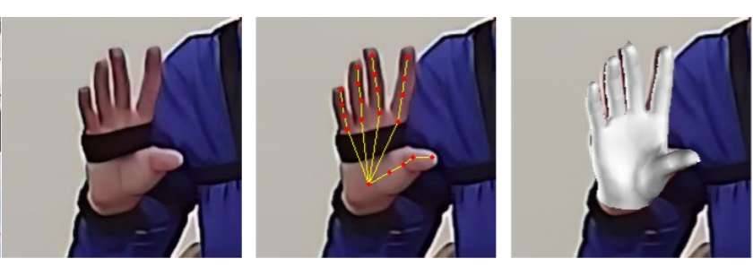
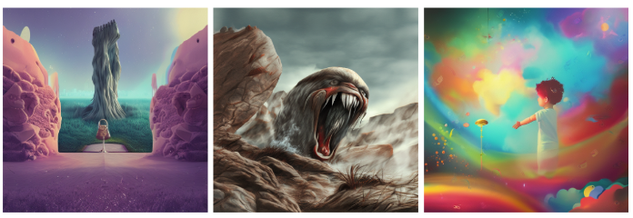

<!-- ## Luke Bidulka -->

Welcome to my corner of the internet!

I'm an ECE MASc student under [Dr. Jane Z Wang](https://bmiai.ubc.ca/people/jane-z-wang) at UBC currently working on combining Deep Learning and signal processing for automatic diagnosis of Parkinson's Disease. My BASc in Electrical Engineering was completed with distinction at UBC in 2022.

I like thinking about AI, robotics and a whole other list of things too long to mention explicitly.

I've also worked on ML for particle physics at [TRIUMF](https://www.triumf.ca/research-program/research-topics/DSQC), developing neutrino event classification algorithms for the under-construction [Hyper-K experiment](https://www.hyperk.org/) in Japan.

I'll fill this page out soon<sup>tm</sup> &emsp; ¯\\\_(ツ)_/¯

## Publications ([Google Scholar](https://scholar.google.com/citations?user=NYjSYxIAAAAJ&hl=en&oi=ao))



&ensp; [PA-Tran: Learning to Estimate 3D Hand Pose with Partial Annotation](https://www.mdpi.com/1424-8220/23/3/1555) \
&ensp; Tianze Yu, **Luke Bidulka**, Martin J. McKeown, Z. Jane Wang \
&ensp; *Sensors*, 2023 \
&ensp; [[Code](https://github.com/Ryan315/my_hand)]
<br clear="left"/>


## Projects ([GitHub](https://github.com/lbidulka))



&ensp; [Music is All You Need for Art](https://github.com/lbidulka/CPSC532S_FinalProject) \
&ensp; Novel method to create visually appealing, mood and genre informed image representations directly from music audio data. \
<br clear="left"/>


## Misc

Heres a list of some papers I've found interesting recently:
- [Perceiver IO: A General Architecture for Structured Inputs & Outputs](https://arxiv.org/abs/2107.14795)
- [Video PreTraining (VPT): Learning to Act by Watching Unlabeled Online Videos](https://openai.com/blog/vpt/)
- [Open-Ended Learning Leads to Generally Capable Agents](https://storage.googleapis.com/deepmind-media/papers/Open-Ended%20Learning%20Leads%20to%20Generally%20Capable%20Agents/open-ended-learning-paper.pdf)
- [Curiosity-driven Exploration by Self-supervised Prediction (PMLR, 2017)](https://arxiv.org/pdf/1705.05363.pdf)
- [Deep physical neural networks trained with backpropagation (Nature 2022)](https://www.nature.com/articles/s41586-021-04223-6#Sec4)

<!-- Theme can be **dark** or **light** the color is dependent on your system theme so go ahead turn it dark.
Text can be **bold**, _italic_, or ~~strikethrough~~ or <kbd>keyboard shortcuts</kbd>.

[Link to another page](./another-page.html).

There should be whitespace between paragraphs.

There should be whitespace between paragraphs. We recommend including a README, or a file with information about your project.

# Header 1

This is a normal paragraph following a header. GitHub is a code hosting platform for version control and collaboration. It lets you and others work together on projects from anywhere.

## Header 2

> This is a blockquote following a header.
>
> When something is important enough, you do it even if the odds are not in your favor.

### Header 3

```js
// Javascript code with syntax highlighting.
var fun = function lang(l) {
  dateformat.i18n = require('./lang/' + l)
  return true;
}
```

```ruby
# Ruby code with syntax highlighting
GitHubPages::Dependencies.gems.each do |gem, version|
  s.add_dependency(gem, "= #{version}")
end
```

#### Header 4

*   This is an unordered list following a header.
*   This is an unordered list following a header.
*   This is an unordered list following a header.

##### Header 5

1.  This is an ordered list following a header.
2.  This is an ordered list following a header.
3.  This is an ordered list following a header.

###### Header 6

| head1        | head two          | three |
|:-------------|:------------------|:------|
| ok           | good swedish fish | nice  |
| out of stock | good and plenty   | nice  |
| ok           | good `oreos`      | hmm   |
| ok           | good `zoute` drop | yumm  |

### There's a horizontal rule below this.

* * *

### Here is an unordered list:

*   Item foo
*   Item bar
*   Item baz
*   Item zip

### And an ordered list:

1.  Item one
1.  Item two
1.  Item three
1.  Item four

### And a nested list:

- level 1 item
  - level 2 item
  - level 2 item
    - level 3 item
    - level 3 item
- level 1 item
  - level 2 item
  - level 2 item
  - level 2 item
- level 1 item
  - level 2 item
  - level 2 item
- level 1 item

### Small image


### Large image


### Definition lists can be used with HTML syntax.

<dl>
<dt>Name</dt>
<dd>Godzilla</dd>
<dt>Born</dt>
<dd>1952</dd>
<dt>Birthplace</dt>
<dd>Japan</dd>
<dt>Color</dt>
<dd>Green</dd>
</dl>

```
Long, single-line code blocks should not wrap. They should horizontally scroll if they are too long. This line should be long enough to demonstrate this.
```

```
The final element.
``` -->
